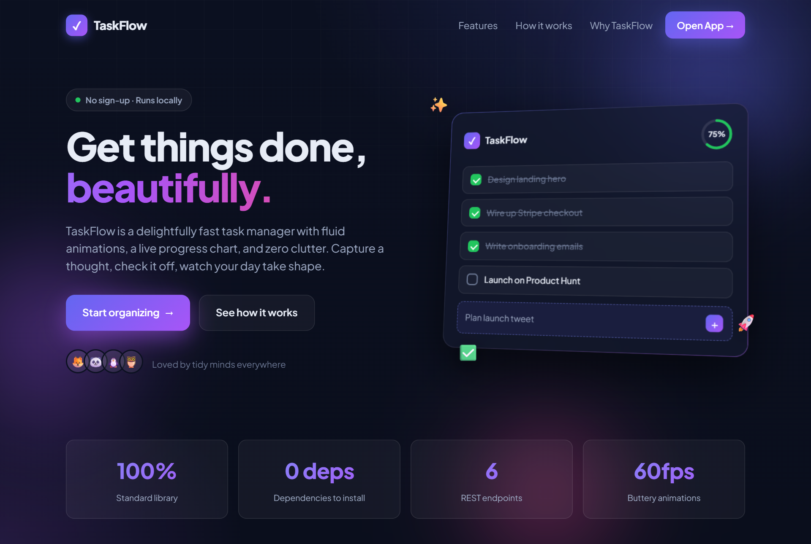
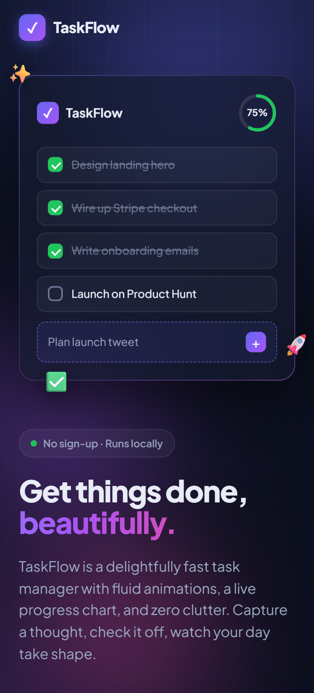
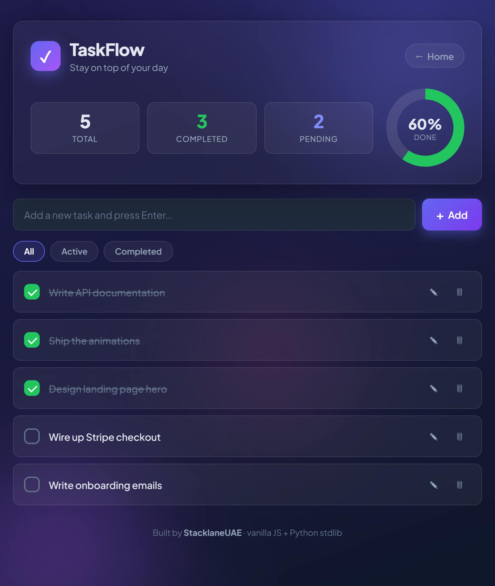
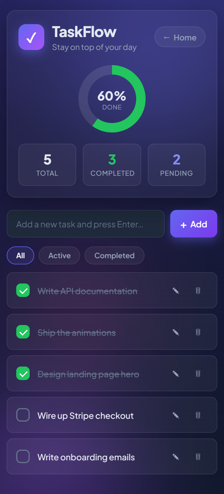

# 🚀 TaskFlow — Task Manager

A small but complete REST API for a task manager **plus a polished single-page web UI** — the kind of backend-and-frontend feature you'd add to an existing SaaS product. Full CRUD, JSON in/out, correct HTTP status codes, input validation, and a health check endpoint.

Built with **Python's standard library only** — no Flask, no `pip install`, no build step. The frontend is **vanilla HTML/CSS/JS** (with [Chart.js](https://www.chartjs.org/) for the progress donut) served by the same server. Runs anywhere.

## 🖼️ Preview

**Animated landing page** (`/`) — hero, live app mockup, feature grid, and reveal-on-scroll motion:

| Desktop | Mobile |
|---------|--------|
|  |  |

**The task app** (`/app`) — animated background, count-up stats, confetti on completion:

| Desktop | Mobile |
|---------|--------|
|  |  |

The web app lets you add, complete, edit (double-click a task or hit ✎), and delete tasks visually, with a live total/completed/pending count and a progress chart at the top. Highlights:

- 🎬 **Animated landing page** with a self-animating app mockup, scroll reveals, count-up stats, and cursor-following spotlights
- 🎉 **Confetti** when you complete a task (a bigger burst when you clear them all)
- 🌫️ **Living gradient background**, staggered task entrances, button ripples, and count-up stat numbers
- 🎨 Modern color scheme, the *Plus Jakarta Sans* Google font, and a fully responsive layout
- ♿ Respects `prefers-reduced-motion` — animations gracefully switch off

## ▶️ Run it
```bash
python app.py
# Task Manager running on http://localhost:8000
#   Landing: http://localhost:8000/
#   Web UI:  http://localhost:8000/app
#   API:     http://localhost:8000/tasks
```
That's it — `python app.py` starts the API **and** serves the site, then opens
`http://localhost:8000/` (the landing page) in your browser automatically.
Click **Open App** to jump into the task manager.

## 📡 Endpoints
| Method | Path          | Description                        |
|--------|---------------|------------------------------------|
| GET    | `/`           | Marketing landing page             |
| GET    | `/app`        | The task manager web app           |
| GET    | `/health`     | Service health                     |
| GET    | `/tasks`      | List all tasks                     |
| POST   | `/tasks`      | Create a task                      |
| GET    | `/tasks/<id>` | Get one task                       |
| PUT    | `/tasks/<id>` | Update a task                      |
| DELETE | `/tasks/<id>` | Delete a task                      |

The frontend lives in [`static/`](static/): `landing.html` + `landing.css` +
`landing.js` for the landing page, and `index.html` + `styles.css` + `app.js`
for the task app. The app talks to the endpoints above with `fetch` — so the UI
is just another client of the API.

## 🧪 Try it
```bash
# list
curl http://localhost:8000/tasks

# create
curl -X POST http://localhost:8000/tasks -d '{"title":"Deploy to production"}'

# update
curl -X PUT http://localhost:8000/tasks/2 -d '{"done":true}'

# delete
curl -X DELETE http://localhost:8000/tasks/1
```

## ✅ What it demonstrates
- RESTful routing and resource design
- JSON request parsing with validation (rejects empty titles & bad JSON)
- Proper status codes (`200`, `201`, `400`, `404`)
- Static-file serving from the same server, with path-traversal protection
- A clean, framework-free frontend (vanilla JS + Chart.js) consuming the API
- Clean, readable handler structure

## 💡 Natural next steps (client talking points)
- Swap in-memory store for SQLite/PostgreSQL
- Add authentication (API keys or JWT)
- Add pagination and filtering on `GET /tasks`

> Note: storage is in-memory, so data resets when the server restarts — by design, to keep the demo dependency-free.

---
Built by **StacklaneUAE** · [github.com/StacklaneUAE](https://github.com/StacklaneUAE)
